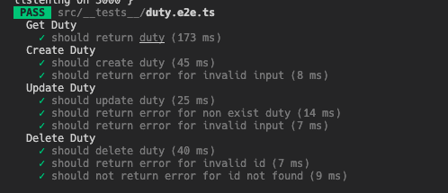

# Backend

## Tech Stack

- ExpressJs for web server
- Zod for data validation

## Getting Started

```sh
# pnpm can be repalce any js package manager e.g. npm, yarn
pnpm install
```

Start the postgres database using docker if not exists.

```sh
docker compose up -d
```

Update `database.json` for db migration

Then, run the db migration for schema

```sh
pnpm db-migrate up
```

```sh
# create file for enironment variable injection for development
cp .env.example .env.local
```

```sh
pnpm dev
```

## Test the application

1. Create a postgres schema for testing since the test will truncate the tables after test. (Use [this](./docker-compose.yaml) if docker installed)
2. update `database.json` to migrate testing schema.
3. Run `pnpm run db-migrate` 
4. Update `.env.test` for the testing database
5. Run `pnpm test`.
   

## Start for production

1. Create `.env.production` in this project root (Not recommend) or inject the required environment variables.

2. Run `pnpm start:prod`
