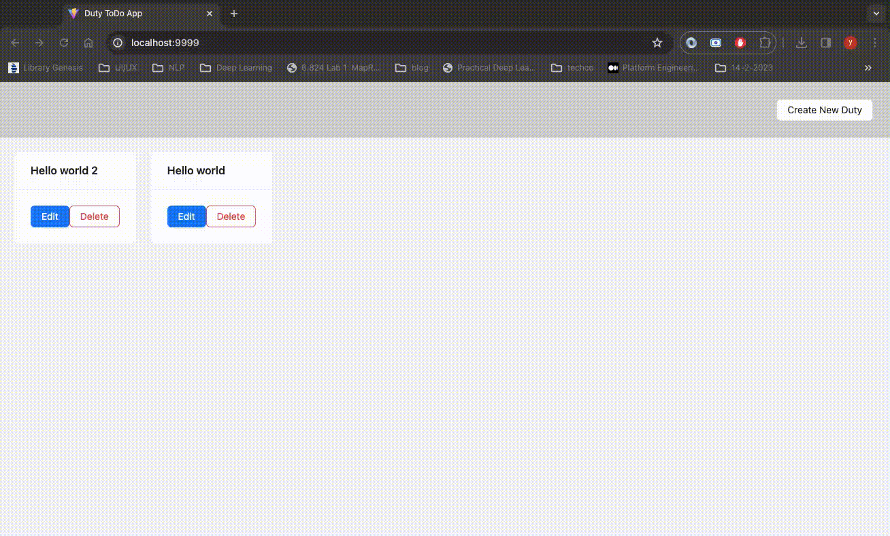
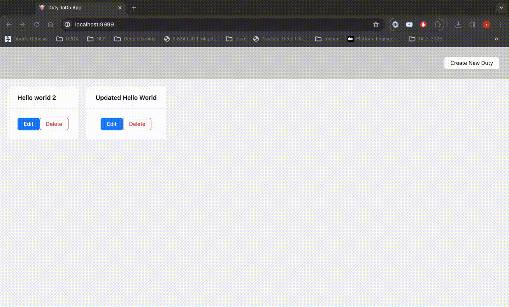

# How to use the App

## Create Duty
1. Click the button of`Create New Duty`
2. Input the details of a duty (e.g. name)
3. Click `OK` button 
4. If it is success, the screen will be updated with new duty  

## Update Duty
1. Click the Edit button for the duty
2. Update the details for the duty
3. Click `OK` button
4. If it is success, the screen will be updated with the updated duty

## Delete Duty
1. Click `Delete` button for the duty
2. Click `Yes` button if confirm to delete
3. If it is success, the deleted duty will disappear in the listing screen.

