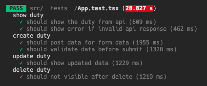

# Frontend

## Getting Started

1. Run `pnpm install`
2. Run `cp .env.example .env.local`
2. Run `pnpm dev`

## Testing the frontend
The test casesm will use DOM to test the component with mocked API response instead of using e2e testing tool like Cypress. 
1. Run `pnpm test`

## Build the frontend for production
1. Create `.env.production` for the build-time env variable 
2. Run `pnpm build`
3. Run `pnpm preview` for preview the assets ([more detail](https://vitejs.dev/guide/static-deploy#building-the-app))

> Noted the built asset is target for modern browser by default. Build setting needs to be updated in order to support legacy browser ([ref](https://vitejs.dev/config/build-options))